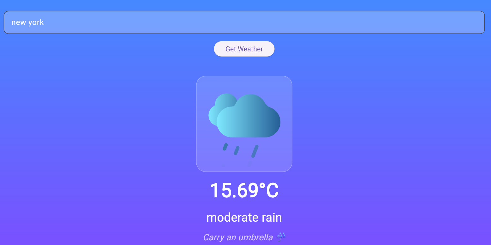
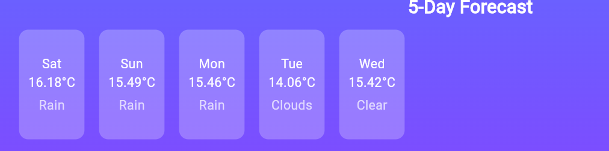
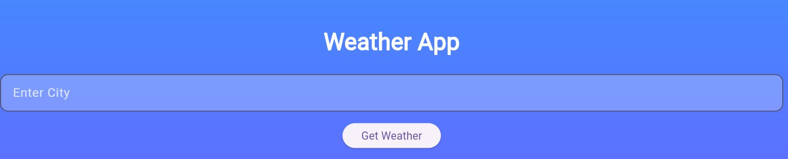
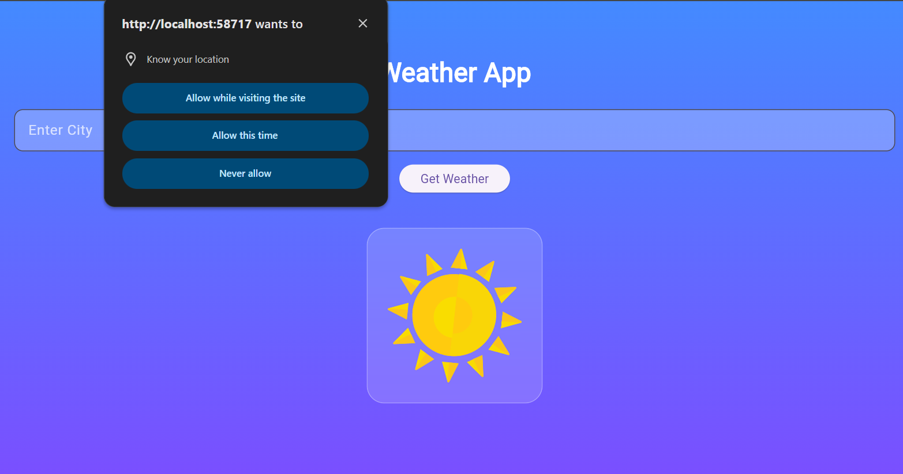

# Weather App

A modern cross-platform weather application built with Flutter that provides real-time weather information, forecasts, and Air Quality Index (AQI) data using the OpenWeather API.

## Features

- Real-time temperature and weather conditions
- Dynamic weather-based backgrounds
- 5-day weather forecast
- Humidity information
- Wind speed
- Sunrise and sunset times
- Air Quality Index (AQI)
- Location-based weather support
- Search weather by city
- Lottie weather animations
- Weather condition alerts
- Secure API key management using environment variables
- Cross-platform Flutter application

## Tech Stack

| Technology | Purpose |
|------------|---------|
| Flutter | Application development |
| Dart | Programming language |
| OpenWeather API | Weather and AQI data |
| Geolocator | Device location |
| Geocoding | Location information |
| Lottie | Weather animations |
| HTTP | REST API communication |
| flutter_dotenv | Environment variable management |
| Git & GitHub | Version control |

## Project Architecture

```text
Weather App
│
├── Flutter UI
│   │
│   ├── Weather Dashboard
│   ├── Forecast
│   ├── AQI
│   └── Location Services
│
├── REST API Layer
│   │
│   ├── Current Weather
│   ├── Forecast
│   └── Air Quality
│
└── OpenWeather API

## Future Improvements

- Weather history
- Saved cities
- Weather charts
- Severe weather notifications
- Offline weather data

## Screenshots

### Weather Dashboard


### 5-Day Forecast


### Weather Parameters


### City Search


### Location-Based Weather


### Home


## Author

**Aditi Shende**

B.E. Computer Engineering  
Artificial Intelligence & Machine Learning